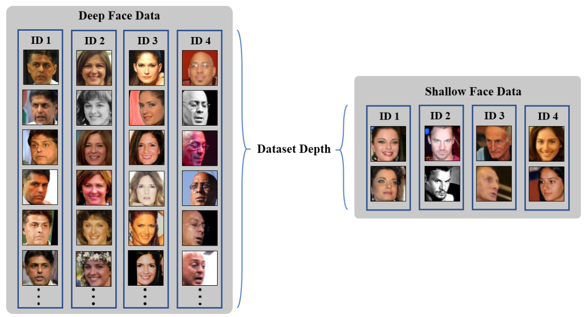
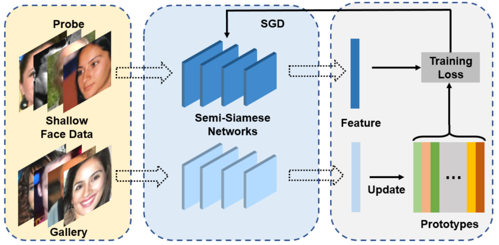

# [Semi-Siamese-Training](https://arxiv.org/abs/2007.08398)

收录到[PytorchNetHub](https://github.com/bobo0810/PytorchNetHub)

## 说明

- 2021.2   仅注释涉及SST源码，方便移植。经测试work!
- 2021.1   官方完整实现 [FaceX-Zoo](https://github.com/JDAI-CV/FaceX-Zoo)
- 2020.10 官方非完整实现 完成注释

- 2020.7   官方非完整实现  [Semi-Siamese-Training](https://github.com/dituu/Semi-Siamese-Training) 

## 项目结构

```
Semi-Siamese-Training
│
└───data_processor/ train_dataset.py/ ImageDataset_SST # 数据集加载格式
│   
└───backbone  # 输出特征已L2正则化，更换网络时注意，否则无法收敛！！！
│   
└───head/ SST_Prototype.py  # SST原型（替代分类器）
│   
└───training_mode/ semi-siamese_training/ train.py # 训练相关
│   
└───Not_fully_implemented # 官方非完整实现 对应的注释
```


## 浅层人脸学习vs深层人脸学习

 

## 基本框架

 